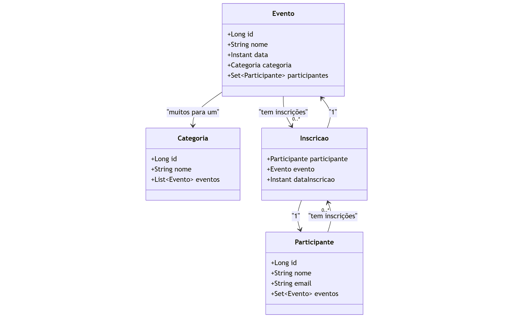

# 📅 Projeto Eventos - API REST com Spring Boot

Este projeto é uma API REST para gerenciamento de eventos, participantes, categorias e inscrições. Foi desenvolvido com **Java**, **Spring Boot**, **JPA/Hibernate** e **Banco de Dados H2**, utilizando boas práticas como DTOs e tratamento de exceções.

## 🚀 Funcionalidades

- **CRUD de Eventos**: criar, listar, atualizar e excluir eventos.
- **CRUD de Participantes**: cadastro e gerenciamento dos participantes.
- **CRUD de Categorias**: organização de eventos por categorias.
- **Inscrições**: permite que participantes se inscrevam em eventos.
- **Relacionamentos JPA**: 
  - Evento pertence a uma Categoria.
  - Participantes se inscrevem em vários eventos (*Muitos-para-Muitos* com entidade intermediária `Inscricao`).
- **Tratamento global de exceções** com mensagens claras e status HTTP apropriados.
- **DTOs (Data Transfer Objects)** para encapsulamento de dados e segurança.

## 🧱 Tecnologias Utilizadas

- Java 17
- Spring Boot
- Spring Data JPA
- Banco de Dados H2 (em memória)
- Postman (para testes da API)
- Maven

## 📝 Diagrama

## 🔗 Endpoints REST principais

### Evento
- `GET /eventos`
- `POST /eventos`
- `PUT /eventos/{id}`
- `DELETE /eventos/{id}`

### Participante
- `GET /participantes`
- `POST /participantes`
- `PUT /participantes/{id}`
- `DELETE /participantes/{id}`

### Categoria
- `GET /categorias`
- `POST /categorias`
- `PUT /categorias/{id}`
- `DELETE /categorias/{id}`

### Inscrição
- `POST /inscricoes/participante/{participanteId}/evento/{eventoId}`
- `DELETE /inscricoes/participante/{participanteId}/evento/{eventoId}`

## 💡 Autor
Desenvolvido por **Victor da Costa Almada**
- 📍 Gravataí, RS
- 💻 Estudante de Análise e Desenvolvimento de Sistemas
- 📚 Apaixonado por tecnologia, backend Java e desenvolvimento de APIs REST.
